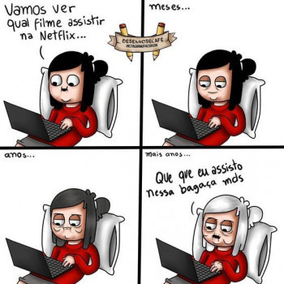
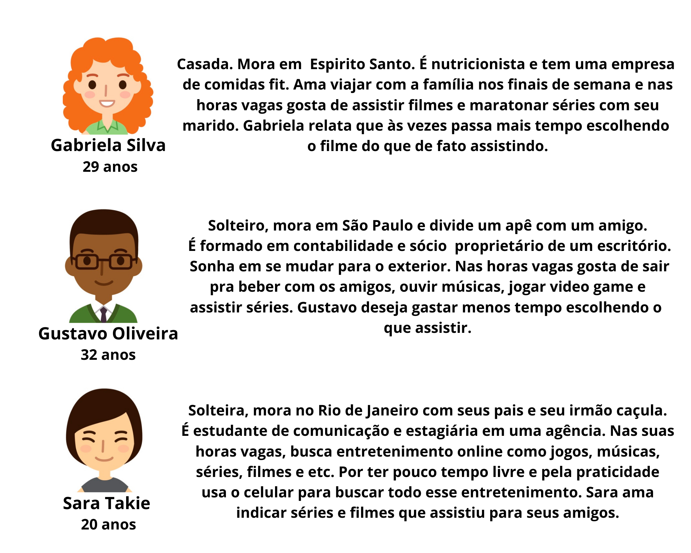
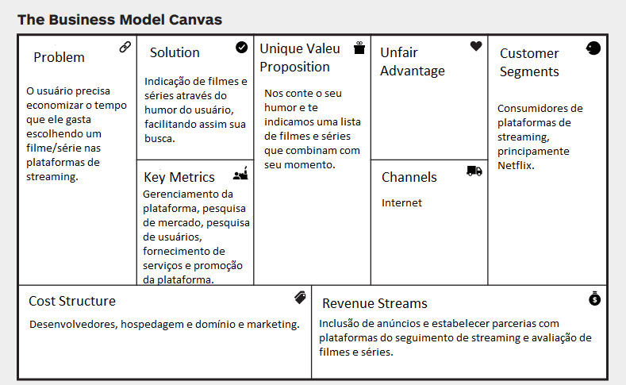
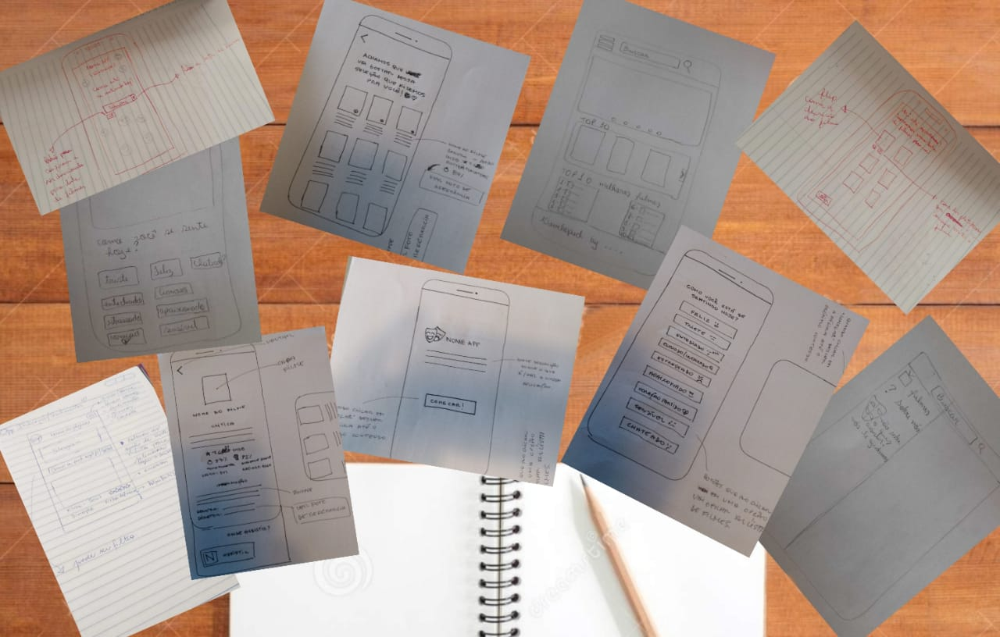
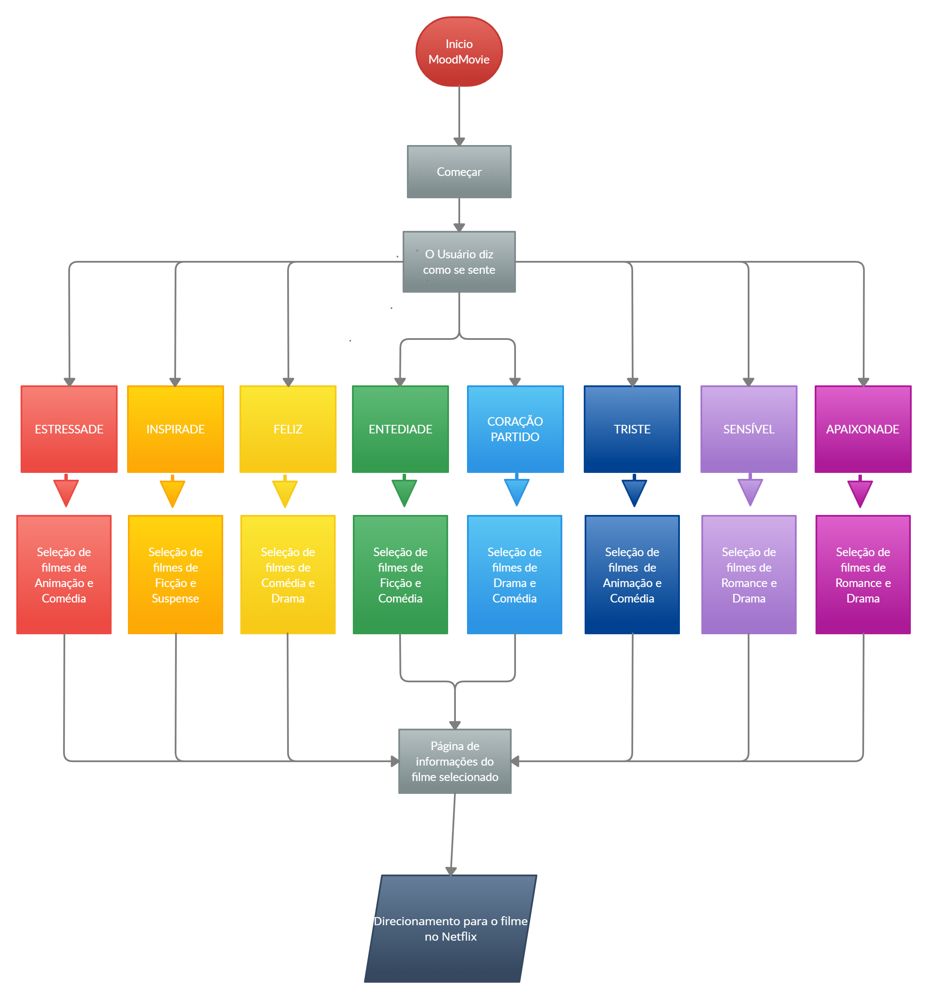
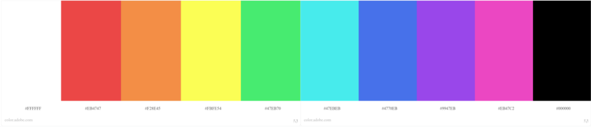
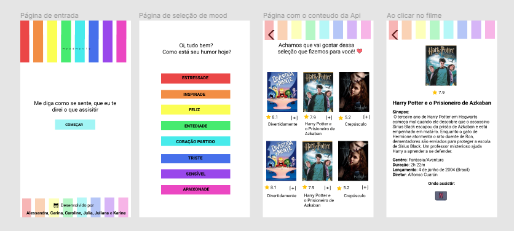

<h1>MoodMovie</h1>

<h3>Cansada de procurar filmes, né minha filha?</h3> 

## Índice

- [1. Introdução](#1-introdução)
- [2. Planejamento e Organização](#2-planejamento-e-organização)
- [3. Desing Sprint](#3-desing-sprint)
- [4. Desenvolvimento](#4-desenvolvimento)
- [5. Desenvolvedoras](#5-desenvolvedoras)

---
## 1. Introdução

A partir do projeto proposto pela [Laboratória](https://github.com/Laboratoria), o Midterm Hackathon. Desenvolvemos em equipe uma aplicação de entretenimento, através do consumo de API, no prazo de dois dias. 
Para o desenvolvimento utilizamos como estratégia pair programing, code review e sub-divisão de tarefas.

### Sobre 

A aplicação MoodMovie tem como intuito facilitar a escolha de filmes do usuário através do seu humor. 

---
## 2. Planejamento e Organização

O planejamento e organização do projeto foi feito com método Kanban, utilizando o [Trello](https://trello.com/). 

---
## 3. Design Sprint

Durante o processo de Design Sprint desenvolvemos o produto em 4 dias.

### Investigação e descoberta

Realizamos um brandstorm e apartir disso criamos nossas protopersonas:

 

Diante disso, foi feita a confirmação através de um formulário de pesquisa com os usuários. 
Realizamos o benchmark, analisando possíveis concorrentes, identificando padrões, pontos positivos e negativos.

### Síntese e definição

Utilizando os dados coletados e gerados na fase  de investigação e descoberta, fizemos um mapa de afinidades usando o [Miro](https://miro.com/app/). Onde identificamos os problemas dos nossos usuários.

❌ Problema:

<i>O usuário precisa economizar o tempo que ele gasta escolhendo um filme nas plataformas de streaming.</i>

Com isso elaboramos um novo formulário de pesquisa para revalidar as personas e mapear as soluções.

💡 Solução:

<i> Indicação de filmes através do humor do usuário, facilitando assim sua busca.</i>

Baseado nisso, produzimos nosso Canvas.

 

Definimos as funcionalidades do nosso MVP, onde o usuário acessa a página de entretenimento, no qual ele pode selecionar o seu humor e assim receber indicações de filmes. 

### Ideação

Compartilhamos nossas ideias em rascunhos, nossos protótipos de baixa fidelidade.

 

 Onde definimos as funcionalidades da aplicação, gerando assim o fluxo do usuário.

 

### Prototipagem

Nessa etapa foi concretizado o desenvolvimento do desing da aplicação. 
O processo criativo inicialmente foi inspirado pelo conceito de emoções, sinalizados pelos usuários durante as pesquisas, e sua relação com as cores, tendo como base o filme ["Divertida Mente"](https://www.youtube.com/watch?v=ukQeR3zYncw&ab_channel=WaltDisneyStudiosBR). 
Com isso, decidimos nossa paleta de cores:

O protótipo foi criado com o [Figma](https://www.figma.com/) em mobile first, após pesquisa de cores e estilo.

Durante a prototipagem foi tomada a decisão de linguagem inclusiva nas emoções, utilizando o sufixo "de". No qual, não emprega definição de gênero. 

### Testes com usuários

Foram entrevistados 5 usuários, que utilizaram a versão do protótipo de alta fidelidade para testar o fluxo de tarefas. 

👍 Os usuários apresentaram facilidade ao executar o fluxo da aplicação e acharam bem intuitivo.

👎 Os usuários clicaram no card ao invés do icone "+", para obter mais informações do filme.

Levando em consideração os feedbacks dos usuários, foram feitas as devidas alterações.

## 4. Desenvolvimento

A aplicação foi desenvolvida como um [Single Page Application (SPA)](https://pt.wikipedia.org/wiki/Aplicativo_de_p%C3%A1gina_%C3%BAnica), utilizando a API [Netflix Roulette](https://apilist.fun/api/netflix-roulette), mediante disso foi realizada o Mock com uma seleção de informações.

Durante o processo, mudanças foram adotadas para melhor desempenho da aplicação no tempo possível para executá-las. A equipe optou por trazer as informações dos filmes junto aos resultados das indicações, tornando o acesso as informações mais rápido para o usuário.

### E aí minha filha, como está seu humor hoje?  Teste nossa aplicação [aqui](https://github.com/ale-alve)

## 5. Desenvolvedoras

Desenvolvido por [Alessandra](https://github.com/ale-alve), [Carina](https://github.com/carinarocha), [Caroline](https://github.com/CarolineSCosta), [Julia](https://github.com/JuliaTerin), [Juliana](https://github.com/julianaads) e [Karine](https://github.com/karinesouza).

